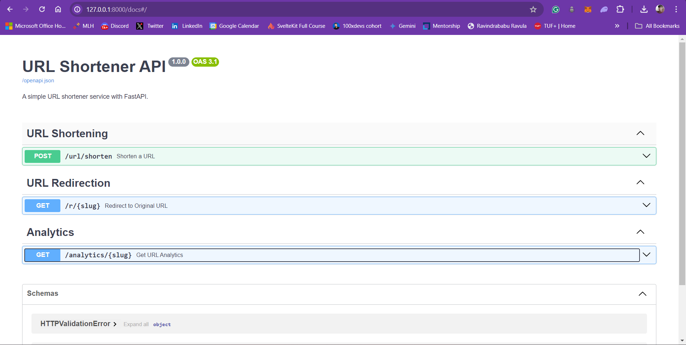

# URL Shortener API By Riteek Rakesh

## Overview

This project implements a simple URL shortener service using FastAPI. The service allows users to shorten URLs, create custom slugs, and set expiration dates for the shortened URLs. It also provides analytics for tracking the number of clicks on the shortened URLs.




## Features

- Shorten URLs with optional custom slugs.
- Set expiration dates for shortened URLs.
- Redirect users to the original URL when accessing the shortened URL.
- View analytics for shortened URLs, including click counts and expiration dates.

## Technologies Used

- **FastAPI**: A modern web framework for building APIs with Python 3.6+ based on standard Python type hints.
- **SQLAlchemy**: ORM for database interactions.
- **PostgreSQL**: Database for storing URL mappings. I have provided my neon postgres link so that you dont need to setup Database by yourself.
- **Pydantic**: Data validation and settings management using Python type annotations.
- **Validators**: Library for validating URLs.

## Getting Started

### Prerequisites

- Python 3.8 or later
- PostgreSQL database
- Redis (optional, for caching)
- Virtual environment (optional, but recommended)

### Installation

1. Clone the repository:

   ```bash
   git clone <repository_url>
   cd <repository_directory>
   ```

2. Create a virtual environment
    ```bash
    python -m venv venv
    source venv/bin/activate # <- on WSL  # On Windows use `venv\Scripts\activate`
    ```

3. install required packages
    ```bash
    pip install fastapi[all] sqlalchemy validators psycopg2
    ```

4. run the application
    ```bash
    fastapi dev
    ```


#### API Endpoints(Check the Swagger at http://127.0.0.1:8000/docs#/)

1. Shorten a URL: POST /url/shorten

2. Redirect to Original: URL GET /r/{slug}

3. Get URL Analytics: GET /analytics/{slug}


##### Problems faced:
1. The use of redis with fastAPI, it was not reading the packags and also the use of await keyword is not allowed for redis client.
2. Rate limiting could not be implemented due to point 1.
3. I have not added cors for this implementation yet.